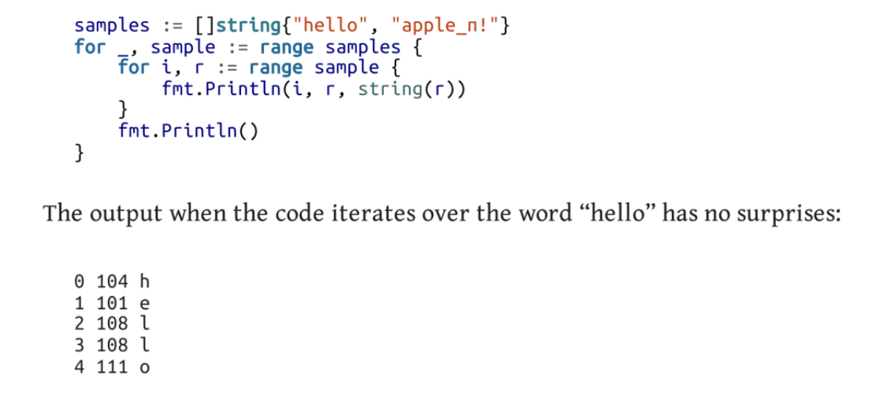

# For loop
```
for i := 0; i<10 ; i++{
    fmt.Printf("%v", i)
}
```
- can skip declerations also, just put semicolons but without anything

## no While loop in Go !!!

```
for CONDITION {
    //do some stuff until condition is true
}
```
```
i := 0
for i<10 {
    fmt.Printf("%v", i)
    i++
}
```

- for can run **infinite** loop if we give it nothing!
```
for {
    //do something for infinite times!
}
```

## From OReilly

## for-range loop
```go
    sl := []int{1, 2, 3, 4, 5}

    for k, v := range sl {
        fmt.Println(k, v)
    }
```
- The range returns the key and value.
### Unnatural case in Maps
- in maps people used to assume that their things are stored in the order they specified.
- but this is not the case
- hence the range of a map returns key_value pair in a random order.
```go
    m := map[string]string{
        "one":   "hi",
        "two":   "hello",
        "three": "pranam",
        "four":  "bye",
    }
    for i := 0; i < 5; i++ {
        fmt.Println("Loop", i+1)

        //every loop map items printed in diff order
        for k, v := range m {
            fmt.Println("Key = ", k, "Value = ", v)
        }
    }
```

## Iterating over Strings


## for-range value is a copy !
- whenever u use for-range loop, it `copies` the value from compound type to the value variable.
- modifying the value variable `would not change` the source.