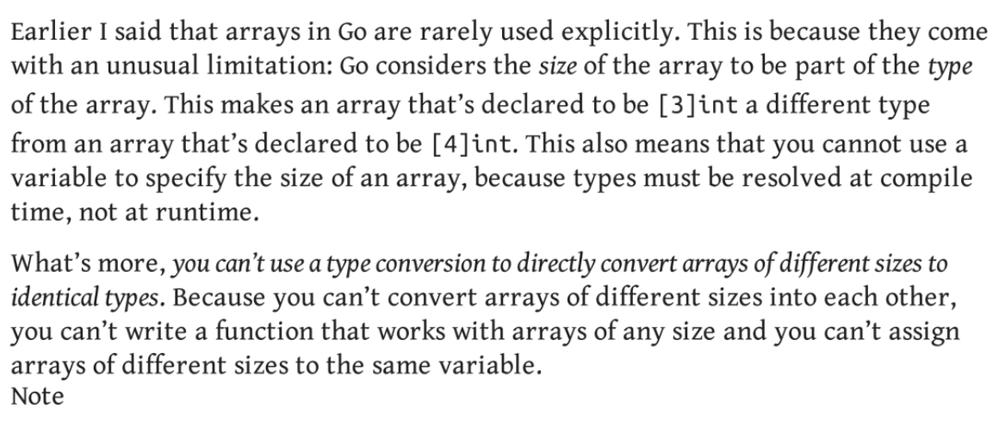

# Arrays

- arrays are less used, but still.
```
var arr [10]int //all index filled with 0 values
```
```
var arr2 = [3]int{1, 2, 3} // initialising list
```
```
var arr3 = [9]int{2: 100, 4: 400, 7: 123} //partial initialising
```
```
var arr4 = [...]int{1, 2, 3} // auto detect length
```

- `len(arr)` gives the length of the array

```
var mArr [2][3]int //multi dimensional array
```

- COMPARING array x1 == x2 returns `true` only when both arrays have the `same size` and `same values` at each index.

- 1st point explained below.

