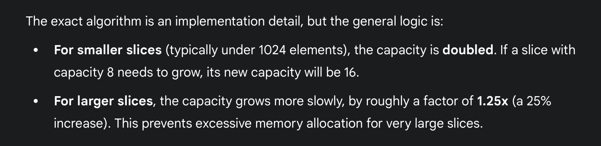
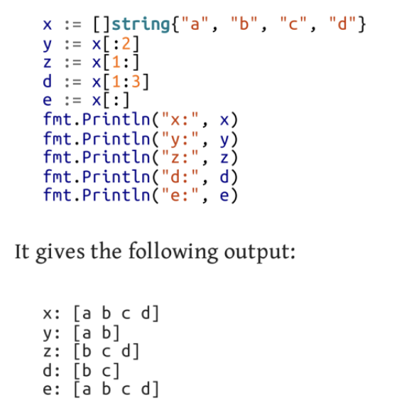

# Slices

- the vector analogous of Golang.
- `int [...]{1,2,3}` declares an `array`
- `int []{1,3,4}` declares a `slice`

- Other declerations similar to array.

```
var sl [][]int //declares a multi dimensional slice.
```

- a blank slice when initiated prints nothing because length is not defined !

- cant compare slices directly using `==` (compile time error)

- Silces are compared using `slices.Equal( slice1, slice2 )` function -> returns true if equal length and same values at same index


## len
- `len(sliceName)` returns the length of slice.

## cap
- `cap(sliceName)` returns the capacity of slice.
- when ran on arrrays, always returns the length ;)...


## append
- `x = append(x, 12)` -> a slice x should exist, to which this function would append the "12" and then return the updated slice
- more than one items can be appended at once using append function.
- can append one slice to another using `...`
```
x := []int{6,7,8}
y := []int{2,3,4}
x = append(x, y...)
```
- while appending if the slice's capacity gets exceeded, then the go runtime, makes a new slice of larger capacity, copies the existing to new one.

## make
- used to create slices with custom length and capacity.
```
x := make([]int, 5) //length 5
x := make([]int, 5, 10) //length 5, capacity 10 ; here also when capacity exceeded, is increased...
``` 
- specifying capacity less than length in make function is `compile time error`.

## clear
- empties the slice (without returning anything)
```
s:= []string{"hello","aditya", "!"}
clear(s)
```

## Declaring Slices
- nil slice is NOT same as a zero-length slice
```
var sl []int //called nil slice ( has 0 length )
var x  = []int{} //not nil slice ( zero-length slice )
```
- when u have values to input then use normal `:=`
```
sl := []int{2,4,6}
```
- if you know certain amount of things need to be placed in the sice, then initiate a 0 length and a capacity using `make` function, and then later `append` into the slice. (Author's recommendation).

## Slicing of Slices
- creates a slice from a slice
- use `sliceName[n1:n2]` to slice a slice.
- `n1` -> FROM which index to start.
- `n2` -> BEFORE which index to stop.
- n1 and n2 default values 0 and the last index respectively,

- Slices share the memory locations
- Changing the value at one index for any slice would change the value of all the slices derived from it.