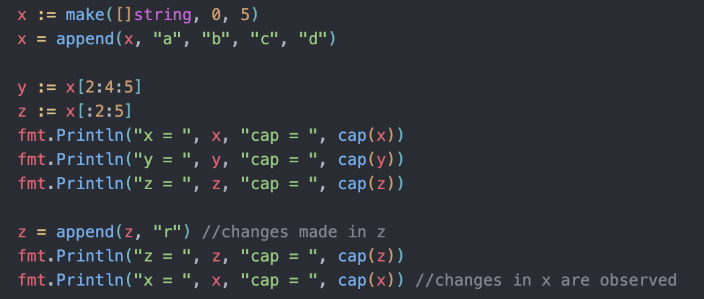

# Slices

- the vector analogous of Golang.
- `int [...]{1,2,3}` declares an `array`
- `int []{1,3,4}` declares a `slice`

- Other declerations similar to array.

```go
var sl [][]int //declares a multi dimensional slice.
```

- a blank slice when initiated prints nothing because length is not defined !

- cant compare slices directly using `==` (compile time error)

- Silces are compared using `slices.Equal( slice1, slice2 )` function -> returns true if equal length and same values at same index


## len
- `len(sliceName)` returns the length of slice.

## cap
- `cap(sliceName)` returns the capacity of slice.
- when ran on arrrays, always returns the length ;)...


## append
- `x = append(x, 12)` -> a slice x should exist, to which this function would append the "12" and then return the updated slice
- more than one items can be appended at once using append function.
- can append one slice to another using `...`
```go
x := []int{6,7,8}
y := []int{2,3,4}
x = append(x, y...)
```
- while appending if the slice's capacity gets exceeded, then the go runtime, makes a new slice of larger capacity, copies the existing to new one.

## make
- used to create slices with custom length and capacity.
```go
x := make([]int, 5) //length 5
x := make([]int, 5, 10) //length 5, capacity 10 ; here also when capacity exceeded, is increased...
``` 
- specifying capacity less than length in make function is `compile time error`.

## clear
- empties the slice (without returning anything)
```go
s:= []string{"hello","aditya", "!"}
clear(s)
```

## Declaring Slices
- nil slice is NOT same as a zero-length slice
```go
var sl []int //called nil slice ( has 0 length )
var x  = []int{} //not nil slice ( zero-length slice )
```
- when u have values to input then use normal `:=`
```go
sl := []int{2,4,6}
```
- if you know certain amount of things need to be placed in the sice, then initiate a 0 length and a capacity using `make` function, and then later `append` into the slice. (Author's recommendation).

## Slicing of Slices
- creates a slice from a slice
- use `sliceName[n1:n2]` to slice a slice.
- `n1` -> FROM which index to start.
- `n2` -> BEFORE which index to stop.
- n1 and n2 default values 0 and the last index respectively,

- if a subslice has a certain capacity, then in the memory it would overwrite its parent element when new data is appended.

## Full slice expression
```go
    x := make([]string, 0, 5)
    x = append(x, "a", "b", "c", "d")

    y := x[:2:2]
    z := x[2:4:5]
    fmt.Println("x = ", x, "cap = ", cap(x))
    fmt.Println("y = ", y, "cap = ", cap(y))
    fmt.Println("z = ", z, "cap = ", cap(z))
```
- the full slice expression gives control over the capacity of slice also along with length.
- Slice `a := x[a:b]` -> a is start and b is end (length = b-a);
- Full Slice `a := x[a:b:c]` -> a is low, b is high, c is max ( length = b-a, capacity = c-a).
- the full slice expression gives control over the maximum index also.
- Witness the overwriting nature of subslices below.

- *never* append to subslices.

## copy (copy A from B)
- copy function copies the contents of a slice to another.
- limited by the length of destination. (not capacity)
```go
    num := copy(y, x)
    //y -> destination; x-> source
    //copy to y from x
```
- `copy` returns the number of elements copied (stored in `num`)
- copy runs without storing the returned value also !
```go
    x := []int{1, 2, 3, 4, 5}
    y := make([]int, 3)
    z := make([]int, 2)

    num := copy(y, x)
    copy(z, x[2:])


    fmt.Println(num) //number of elements copied
    printSliceWithName("x", x) //x  =  [1 2 3 4 5]
    printSliceWithName("y", y) //y  =  [1 2 3]
    printSliceWithName("z", z) //z  =  [3 4]

    copy(x[:2], x[1:]) //works on subslices of same slice also !
    printSliceWithName("x", x) // x  =  [2 3 3 4 5]
```