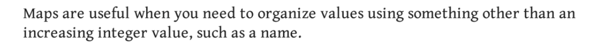

# Maps
- The data type used to store key value pairs.

## nil Map
```go
//map[keytype]valueType
var nilMap map[string]int //length is 0
```
- Reading a nilMap always returns 0 for value.
- Writing to a nil map leads to `Panick`.

## empty map
```go
empMap := map[string]int{}
```
- Length 0
- CAN read and write values 

## non Empty Maps
```go
some := map[string][]string

someThing := make(map[int][], 10)
```
- We use make function to demand map of specific type.

## Note that
- MAPS ARE `NOT COMPARABLE`.
- zero value for a map is `nil`.
- maps may only be compared whether nil or not
- The keys of a map can only be of a comparable type.
- thus can not use `map` or `slice` as a key.



## CRUD in maps
```go
    teams := map[string][]string{
        "CSK": {"dhoni", "ashwin", "raina"},
        "MI":  {"rohit", "pandya", "pollard"},
    }

    fmt.Println(teams)
    fmt.Println(teams["CSK"])

    teams["CSK"] = append(teams["CSK"], "jadeja")
    newTeam := []string{"verma", "badoni", "vohra"}
    teams["MI"] = newTeam

    fmt.Println(teams["MI"])
    fmt.Println(teams["CSK"])

    delete(teams, "MI")
    fmt.Println(teams)
```

- `clear` function - also in maps!
```go
    m := map[int]string{
        1: "hello",
        2: "there",
        3: "mister",
    }

    fmt.Println(m)
    clear(m)
    fmt.Println(m)
```

## Comma ok idiom
- Map return 0 when asked for a key's value that is not in the map.
- what if a key exists and has value 0?
- Comma ok method helps in that...
```go
    m := map[string]int{
        "hello": 2,
        "world": 0,
    }
    v, ok := m["hello"]
    fmt.Println(v, ok)
    v, ok = m["world"]
    fmt.Println(v, ok)
    v, ok = m["brick"]
    fmt.Println(v, ok)
```
- Returns `false` if corresponding value not in map

## Equal function
```go
    m := map[int]string{
        1: "hi",
        2: "there",
    }
    n := map[int]string{
        1: "hi",
        2: "there",
    }
    fmt.Println(maps.Equal(m, n))
```
- Returns boolean value of whether maps are exactly same or not.

## Traversing a Map
- Traversing using for loop is done by the `range` keyword.
- `k,v := range map` (put _ if any variable not needed.)
```go
    map1 := map[int]bool{}
    sl := []int{1, 2, 3, 4, 2, 2, 3, 4, 1, 21, 34, 2, 2} //6 unique values.

    //collect unique values from sl (like make a set.)

    for k, v := range sl {
        fmt.Println("the ", k, "th value of slice is ", v)
    } //traverse through slice

    for _, v := range sl {
        map1[v] = true
    }

    fmt.Println(len(map1)) //gives 6

    //to check if 4 is in the set
    if map1[4] {
        fmt.Println("yes its there !")
    }

    for k, v := range map1 {
        fmt.Println(k, " -> ", v)
    }
```