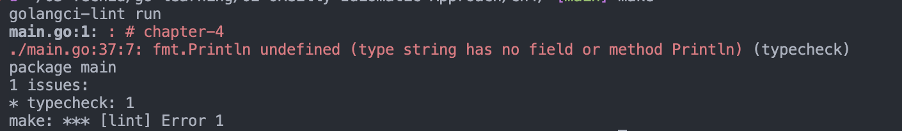

# Blocks

## Shadowing
- any identifier from the outer block can be used in the inner block.
- but when you initialise another identifier in side the block with the same name as that of outer one, then we `shadow` the outer block identifier.
```go
    x := 10
    if x > 5 {
        fmt.Println(x) //10
        x := 23        //not reassigning the outer variable. Initialising new one.
        fmt.Println(x) //23 (outer variable gets shadowed)
    }
    fmt.Println(x) //10
```
- `Shadowing Variable` - is a variable with the same name as a variable in a containing block.
- No way to access a "shadowed variable" once shadowed in the block.
- we can also shadow with multiple assignments :- 
```go
    z := 1
    if z < 4 {
        fmt.Println("z", z)
        z, y := 10, 2 //looks like re-assign, but actually SHADOWING happens.
        fmt.Println("y", y)
        fmt.Println("z", z)
    }
    fmt.Println("z", z)
```
- while using `:=` make sure that you are not initialising a variable from the outer block !
<br><br>

## Shadowing Packages
- try to shadow "fmt" package.
```go
    fmt.Println("here we can use fmt package")
    fmt := "hel"
    fmt.Println("hey") //would cause compiler issue
```


## The Universe Block
- Go has just 25 keywords!!!
- but you have so many things na `true`, `nil`, even finctions like `make`, `close` etc. How does it work then?
- The universe block is the one block that contains all the other blocks.
- So many things are not keywords, rather Go considers them as *predeclared identifiers* and defines them in the universe block...
- Thus these can be shadowed.
- watch this
```go
    shiv := true
    true := "shiv"
    fmt.Println(true, shiv)
```
- *never* redefine any identifier in the universe block !
- for obvious and legal reasons ;).