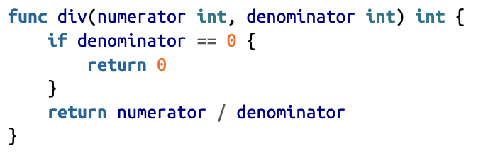
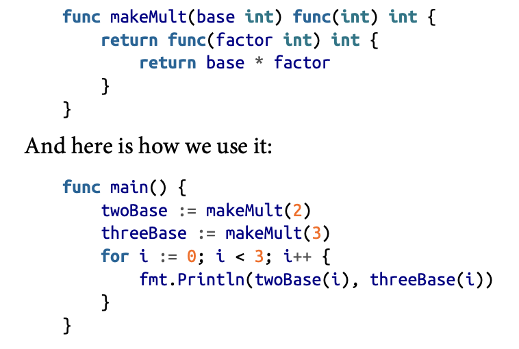
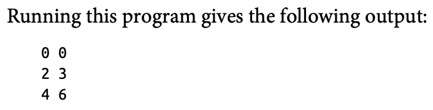

# Functions
- basic, different, human understandable repositioning in the definition.


- can return multiple things.
- named returns possible.

## Variadic Parameters
- can supply as many params as u want.
- the `...` treats the params as a slice and then does the job as required.
```go
func addTo(base int, vals ...int) int {
	num := base
	for _, v := range vals {
		num += v
	}
	return num
}
```
```go
fmt.Println(addTo(2, 1, 2, 3, 4)) //output = 12
fmt.Println(addTo(2, []int{1, 2, 3}...)) // output = 8
```
- note that while passing the whole slice we need to define a slice and then also use the `...` (or else compilation error).

## Multiple return values
- Go allows to return multiple things
- good practice to always return error with each and every function.
- here we use named returns , which is cool so use it. (but with caution)
- the names of the returned values as defined in the function are `local` to the function...(dont worry)
- just dont shadow any variable...
- the named return thing makes predefined variables which can be assigned values in the function and then returned.
```go
func divideWithReturn(num, denom int) (quotient int, remainder int, err error) {
	if denom == 0 {
		err = errors.New("can't divide by 0")
		return quotient, remainder, err
	}
	quotient, remainder = num/denom, num%denom
	return quotient, remainder, err
}
```
```go
    //while calling the func
    ans, remainder, error := divideWithReturn(2, 0)
	if error != nil {
		fmt.Println(error)
	} else {
		fmt.Println("the answer of division = ", ans)
		fmt.Println("the remainder = ", remainder)
	}
```
## ignoring return values
- use uderscore `_`, nothing special.
## blank returns
- also called `naked` return... :(
- naked return when used with the functions which are not supposed to return anything, leads to just end of function.
- but if function has return values, named return values, then the naked returns the values at which those variables are set at that line of code.

## Functions are Values
- can define functions and then add them to maps and stuff...
## funtions as Type
- just like we defined structs, we can also define function as a type.
```go
type aFuncType func(int,int) int
```
- useful if want to pass a kind of function through another...
```go
type aFuncType func(int, int) (int, int, error)

func performAFunc(theFunction aFuncType, a, b int) (quotient int, err error) {
	quotient, _, err = theFunction(a, b)
	return quotient, err
}
```
- the type definition is outside the main function.
- meanwhile in the main func
```go
{
    ans, err := performAFunc(divideWithReturn, 10, 3)
    if err != nil {
        fmt.Println(err)
    }
    fmt.Println(ans)
}
```
## closures
- closurs = functions declared inside another function
- if within a funciton u need to do a task repeatedly, then make a closure
- define the closure and it will remain for the specific function only.
- this `limits` the scope of function.
```
This reduces the number of declarations at the package level, which can make it easier to find an unused name.
```
- Closures are able to access and modify the variables in the outer function.
## Returning Functions from Functions
- we can return a closure.


## defer
- to ensure clean finish of functions and readablity things, use defer keyword.
- defer and then give which function to run after the function returns the value.
- `multiple` defers permitted. the last defer registered executes first.

# functions are pass by values
- heading says it all...
- the parameters passed through the functions are not changed directly
- a copy of the arguments are made for the function purposes
