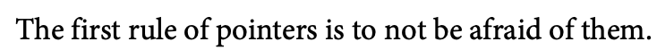
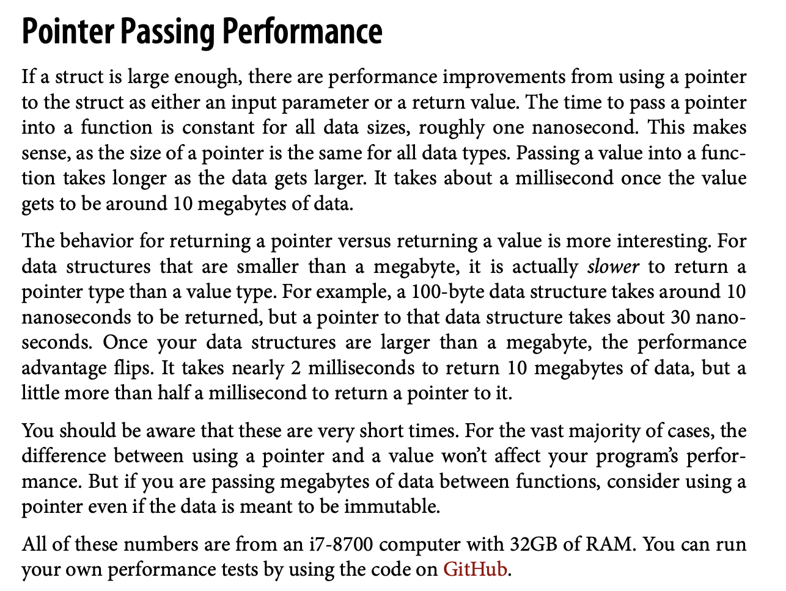
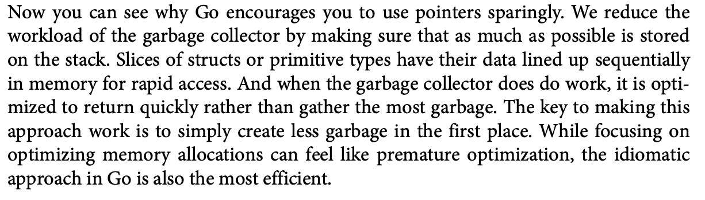

# Pointers
- `&` to supply the address of the variable.
- `*` used to dereference the value when pointer known.
```go
	{
		variable := 10
		pointer := &variable

		fmt.Println(pointer) //prints hex value (the address)
		fmt.Println(variable)
		fmt.Println(*pointer)
	}
```

## nil pointers
- the "zero value" for a pointer is the nil pointer, which is the default if you not assign a value to a pointer.
```go
	{
		var p *int
		fmt.Println(p == nil) //prints true
		fmt.Println(*p)       //panic
	}
```

## `new` function
- the built in function new makes a pointer of the specified type. 
- this one makes a pointer pointing to the `zero value` of the respective data type supplied.
```go
	{
		pt := new(int)
		fmt.Println(pt == nil) //prints false
		fmt.Println(*pt)       //doesn't panic returns 0
		fmt.Println(pt)
	}
```



## passing pointers to functions
- we can pass pointers to the function to make it pass by reference.
- note that when a nil pointer is passed in the argument, then that pointer can `not be modified`.
- the pointer if has an address already only then can it be modified.


## performace and pointers
