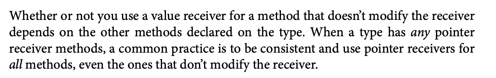

# Types, Methods

## Types
- go is statically typed language
- both in built and user defined types exist.
```go
type myStructType struct {
    first string
    last string
    age int
}
```
- the above definition is basically a custom `user defined` type, with the `underlying structure` of a `struct`.
```go
type Score int
type Converter func(string)Score
type TeamScores map[string]Score
```

## Methods
- the funtions which are specific to structs
- defined normally like funcitons only, except the extra "receiver" block.
```go
type person struct {
    first string
    last string
    age int
}

func (p person) String() string {
    return fmt.Sprintf("%s %s, age %d ", p.first, p.last, p.age)
}
```
- receiver block convention to use small abbreviation of the type name.

### using pointers in method receivers

- if i make a method with pointer receiver.
- then even when we call `c.method()` it would do the job 
- like specially using something like `(&c).method() is not required`.
- go ++ :lol

<br><br>
### its generally `not recommended` to write getter and setter for each struct
- use methods to implement business logic only...
- `exception`: when u need to change various fields or changing field is not as straightforward as re assigning the value...