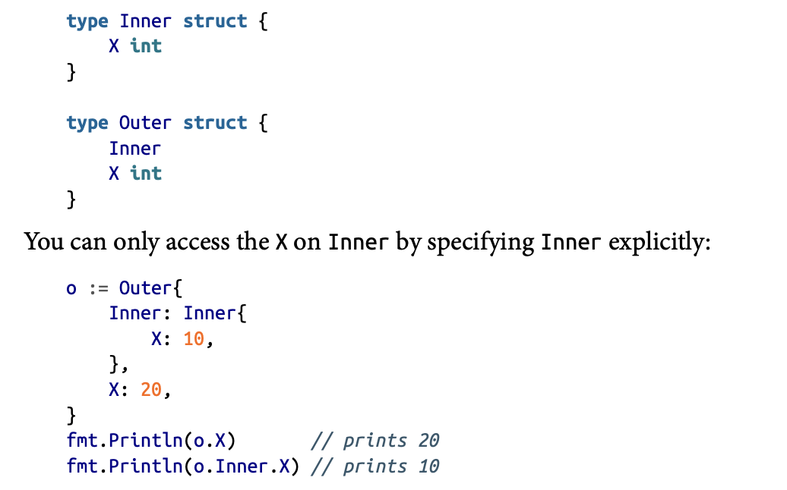

# Use Embedding for Composition

- using embddings helps to deal with code reusability.
- following is example showing embedding a struct inside another struct.
```go
	{
		type Employee struct {
			name   string
			age    int
			salary int
		}
		type Manager struct {
			Employee
			Reports []Employee
		} // the manager is basically an employee with additional field.

		oneManager := Manager{
			Employee: Employee{
				name:   "adi",
				age:    23,
				salary: 123,
			},
			Reports: []Employee{},
		}

		fmt.Println(oneManager.name) //directly accessible
	}
```
- if we had made a field which contained the employee sttruct then would have needed and extra one step to go to that field and then the respective field inside the Emplooyee struct.
- can embed `any type` inside a struct.
- **This promotes the methods on the embedded type to the containing struct.**

## special case
- the one case where u are forced to use extra step to access the embedded field is...
- when the struct and embedded struct share the same field name...


## embedding is not inheritance !!!
- you cant assign the manager type variable to a new variable of employee type.
- While embedding one concrete type inside another won’t allow you to treat the outer type as the inner type, the methods on an embedded field do count toward the method set of the containing struct. This means they can make the containing struct implement an interface.