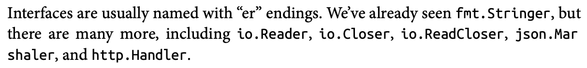
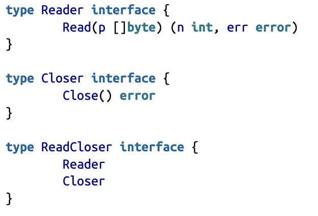

# Quick Interfaces lesson
- the only abstraction type in Golang...
```go
    type Stringer interface {
        String() string
    }
```
- in the interface definition , u need to give the methods which a concrete type should implement.
- any `type` which implements those types becomes that interface then...
- convention

## Interfaces are type-safe
- Go is famous because it implicitly implements interfaces.
- any type which follows the method requirement for the interface, implements that interface -> simple no bakwaas.
- `duck typing` - “If it walks like a duck and quacks like a duck, it’s a duck.”

## embedding and interfaces
- yes! just like structs, you can embed an interface within an interface or a  struct also !!!


## accept interfaces, return structs
- yes its recommended to take interfaces as the argument to functions
- but return concrete type like structs etc.
